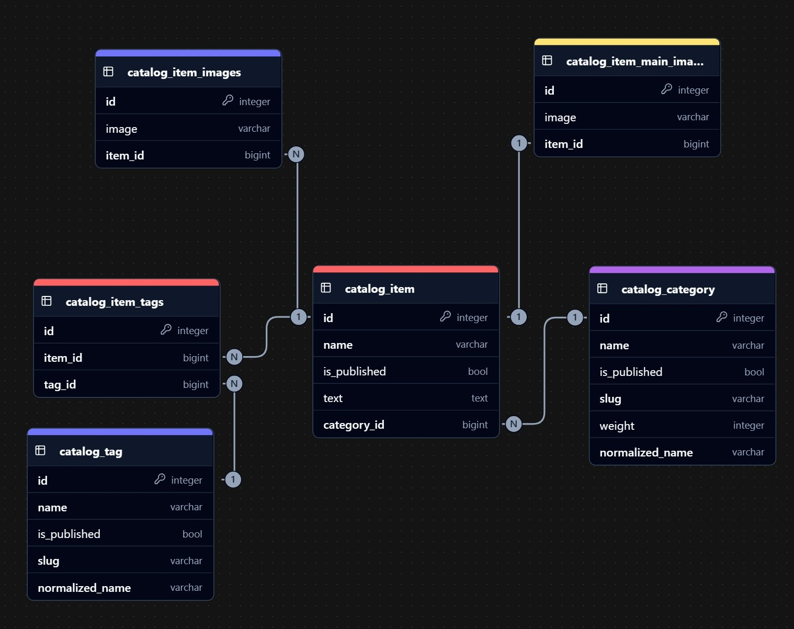

# Lyceum


## Описание проекта
Этот проект представляет собой систему каталога товаров с категориями, тегами и валидацией данных. В корне репозитория находится ER-диаграмма базы данных (`ER.jpg`), которая иллюстрирует структуру базы данных.



## Установка и запуск в dev-режиме

### **1️⃣ Клонирование репозитория**
```sh
git clone https://gitlab.crja72.ru/django/2025/spring/course/students/307818-EugeneINNO-course-1340.git
```

Заходим в проект
```sh
cd 307818-EugeneINNO-course-1340
```

---

### **2️⃣ Создание и активация виртуального окружения**
```sh
python3 -m venv venv
source venv/bin/activate  # Linux/MacOS
# Для Windows:
# venv\Scripts\activate.ps1 (PowerShell)
# venv\Scripts\activate.bat (CMD)
```

---

### **3️⃣ Настройка `.env`**
Пропишите в командной строке следующий код для создания .env файла переменных окружения и копирования туда стандартных переменных:
```sh
copy .env.template .env # Windows
cp .env.template .env # Linux / macOS
```

---

### **4️⃣ Установка зависимостей**
#### **Продакшн (основные зависимости)**
```sh
pip install -r requirements/prod.txt
```
#### **Для разработки (с доп. инструментами)**
```sh
pip install -r requirements/dev.txt
```
#### **Для тестов**
```sh
pip install -r requirements/test.txt
```

---

### **5️⃣ Применение миграций**
После установки зависимостей примените миграции для создания баз данных:
```sh
cd lyceum
python manage.py migrate
```

---

### **6️⃣ Загрузка тестовых данных (фикстуры)**
Чтобы загрузить тестовые данные, используйте фикстуру `fixtures/data.json`:
```sh
cd lyceum
python manage.py loaddata fixtures/data.json
```
Эта фикстура содержит начальные данные для тегов, категорий и товаров, соответствующие моделям проекта.

---

### **7️⃣ Настройка локализации**
Проект поддерживает английский (en) и русский (ru) языки:

Создайте файлы переводов:
```sh
mkdir locale
python manage.py makemessages -a
```

Отредактируйте locale/ru/LC_MESSAGES/django.po, добавив переводы для меню и других статических элементов.

Скомпилируйте переводы:
```sh
python manage.py compilemessages
```
### **8️⃣ Запуск тестов**
Для проверки функциональности проекта выполните тесты:
```sh
python manage.py test
```
Тесты покрывают модели, валидаторы, уникальность данных и эндпоинты проекта. Убедитесь, что зависимости из `requirements/test.txt` установлены.

---

### **9️⃣ Запуск dev-сервера**
Запускаем сервер Django в режиме разработки (**DEBUG=True** в `.env`):
```sh
python manage.py runserver
```
Сервер будет доступен по адресу: **[http://127.0.0.1:8000/](http://127.0.0.1:8000/)**